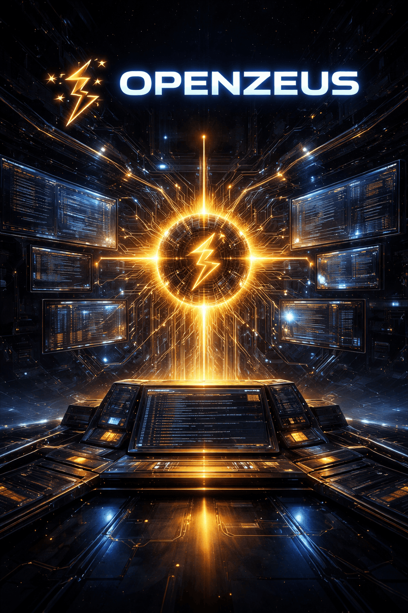

# OpenZeus

**Master of OpenCode — Ruler of the OpenCode realm**

OpenZeus is an advanced AI agent for OpenCode that provides comprehensive system-level operations, documentation management, and autonomous configuration management. Built with extensive skills, agents, and commands for optimal OpenCode workflow orchestration.



## Features

- **🏛️ Master Agent**: Comprehensive OpenCode knowledge and operation
- **🛠️ 14 Zeus Skills**: Specialized skill bundles for different domains
- **⚡ Smart Commands**: Custom commands for common workflows  
- **🔄 Bidirectional Sync**: Automatic sync between repo and OpenCode config
- **📚 Documentation Cache**: Offline OpenCode documentation access
- **🔧 Self-Optimization**: Continuous performance monitoring and improvement
- **🎯 Proactive Intelligence**: Auto-detection of user intent and skill loading

## Installation

### Option 1: NPM (Recommended)

```bash
# Install globally with npm
npm install -g openzeus

# Or with bun (when available)
bun install -g openzeus
```

### Option 2: Manual Installation

```bash
# Clone repository
git clone https://github.com/Aveer/OpenZeus.git
cd OpenZeus

# Run installer
./scripts/install.sh
```

## Quick Start

### 1. Set as Default Agent

Add to your `~/.config/opencode/opencode.json`:

```json
{
  "default_agent": "OpenZeus"
}
```

### 2. Use via @mention

```bash
@OpenZeus help me configure OpenCode for my project
@OpenZeus create a new skill for Docker management  
@OpenZeus show me system health and performance
```

### 3. Access Zeus Skills

Skills load automatically based on context:

```bash
@OpenZeus I need help with Docker containers
# → Automatically loads zeus-docker skill

@OpenZeus create a new agent for my project  
# → Loads zeus-agents + zeus-core skills
```

### 4. Use Zeus Commands

```bash
/zeus-kanban          # Project kanban board
/zeus-git-commit      # Smart git commit helper
/zeus-roadmap         # Generate project roadmap
```

## Usage Examples

### Agent Creation
```bash
@OpenZeus create a new agent called "DataAnalyst" that specializes in SQL queries and data visualization

# → Creates agent with proper permissions and skills
# → Available immediately in OpenCode
```

### Skill Creation  
```bash
@OpenZeus create a skill for AWS management with EC2, S3, and Lambda operations

# → Creates zeus-aws skill bundle
# → Adds to OpenZeus skill loading guide automatically
```

### System Health
```bash
@OpenZeus check your system health and performance

# → Loads zeus-self skill
# → Runs comprehensive diagnostics
# → Reports configuration, capabilities, context health
```

### Docker Management
```bash
@OpenZeus help me containerize this Node.js application

# → Auto-loads zeus-docker skill
# → Creates Dockerfile, docker-compose.yml
# → Provides deployment instructions
```

### OpenCode Configuration
```bash
@OpenZeus configure OpenCode for my React project with TypeScript

# → Loads zeus-core skill
# → Sets up proper model, permissions, tools
# → Configures project-specific settings
```

## Development

### Testing Package Installation

```bash
# Test installation locally
npm pack
npm install -g openzeus-1.0.4.tgz

# Verify OpenZeus is available
@OpenZeus self
```

### Contributing

1. Fork the repository
2. Create feature branch: `git checkout -b feature/my-feature`
3. Make changes and test thoroughly
4. Run sync: `./scripts/sync-utils.sh push`
5. Commit: `git commit -am 'Add my feature'`
6. Push: `git push origin feature/my-feature`
7. Create Pull Request

## Troubleshooting

### Common Issues

| Issue | Solution |
|-------|----------|
| `OpenZeus not available` | Run `npm install -g openzeus` and restart OpenCode |
| `Skills not loading` | Restart OpenCode or check `~/.config/opencode/skills/zeus-*` |
| `Config not found` | Install OpenCode first: https://opencode.ai/docs/ |
| `@OpenZeus not responding` | Add `"default_agent": "OpenZeus"` to `opencode.json` |

## License

MIT License - see LICENSE file for details.

## Links

- **Repository**: https://github.com/Aveer/OpenZeus
- **Issues**: https://github.com/Aveer/OpenZeus/issues  
- **OpenCode Docs**: https://opencode.ai/docs/
- **NPM Package**: https://npmjs.com/package/openzeus

---

**🏛️ Welcome to the realm of OpenZeus!**

### As Primary Agent

Use OpenZeus as your main agent by adding to your `opencode.json`:

```json
{
  "default_agent": "OpenZeus"
}
```

### Via @mention

Invoke OpenZeus in any conversation:
```
@OpenZeus help me configure my OpenCode setup
```

### Key Capabilities

- **System Configuration**: Expert OpenCode config management
- **Agent Creation**: Generate custom agents with proper templates
- **Command Creation**: Create slash commands for workflows
- **Skill Management**: Create and manage skill bundles
- **Self-Improvement**: Extend OpenZeus capabilities with new skills
- **Plugin Documentation**: Guides for external OpenCode plugins (swarm, beads, etc.)
- **Performance Monitoring**: Session diagnostics and optimization
- **Documentation**: Instant access to OpenCode docs (cached)

## Available Zeus Skills

OpenZeus provides 14 specialized knowledge bundles organized into three categories:

### **🧠 Zeus Knowledge & Reference**
| Skill | Purpose |
|-------|---------|
| `zeus-core` | Complete OpenCode reference - paths, configs, schemas, troubleshooting |
| `zeus-docker` | Docker and containerization expertise with examples and best practices |
| `zeus-sql` | Database operations, SQL queries, schema design, and ORM patterns |

### **🛠️ Zeus Creation & Development**  
| Skill | Purpose |
|-------|---------|
| `zeus-agents` | Agent creation templates, permissions, and workflow patterns |
| `zeus-commands` | Custom command creation - prompts, templates, and OpenCode integration |
| `zeus-skills` | Skill bundle creation guide with structure and best practices |
| `zeus-context` | Context management, compression strategies, and conversation optimization |

### **🏛️ Zeus Self-Awareness & Growth**
| Skill | Purpose |
|-------|---------|
| `zeus-self` | **Runtime introspection** - health checks, performance analysis, session diagnostics |
| `zeus-upskill` | **Self-improvement** - learns new skills, updates capabilities, extends knowledge |

### **🔌 External Plugin Documentation**
These skills provide documentation and integration guides for external OpenCode plugins:

| Skill | Plugin | Repository |
|-------|--------|------------|
| `zeus-swarm` | opencode-swarm | [Multi-agent orchestration](https://github.com/opencode/opencode-swarm) |
| `zeus-llm` | Local LLM setup | llama.cpp, Ollama configuration guides |
| `zeus-omo` | oh-my-opencode-slim | [Terminal integration](https://github.com/opencodetips/oh-my-opencode-slim) |
| `zeus-beads` | Beads issue tracker | [Steve Yegge's Beads](https://github.com/steveyegge/beads) |
| `zeus-oac` | OpenAgentsControl | [Plan-first development](https://github.com/darrenhinde/OpenAgentsControl) |

### **🎯 Specialized Skills**

**zeus-self**: Runtime diagnostics and performance monitoring
- Session health checks and diagnostics
- Tool usage tracking and metrics
- Context optimization recommendations
- Operational awareness for long-running sessions

**zeus-upskill**: Self-improvement workflows
- Guides creation of new OpenZeus skills
- Updates knowledge base with new capabilities
- Automates registration of new skills in OpenZeus
- Expands OpenZeus expertise through guided workflows

## How It Works

OpenZeus automatically loads appropriate skills based on your intent:

| When you say... | OpenZeus loads... |
|-----------------|-------------------|
| "config", "opencode.json" | zeus-core |
| "create agent" | zeus-agents + zeus-core |
| "create command" | zeus-commands + zeus-core |
| "docker", "container" | zeus-docker + zeus-core |
| "analyze self", "optimize" | zeus-self + zeus-context |

## Development

### Creating New Skills

Just ask OpenZeus:

```bash
@OpenZeus create a skill for [your topic]
```

OpenZeus will handle the creation, registration, and sync automatically.

### Contributing

1. Fork the repository
2. Create feature branch
3. Add skills, commands, or enhancements
4. Test with OpenCode
5. Submit pull request

## License

MIT License - see LICENSE file for details

## Support

- **Repository**: [GitHub.com/Aveer/OpenZeus](https://github.com/Aveer/OpenZeus)
- **Documentation**: Check `docs/` directory
- **Issues**: [GitHub Issues](https://github.com/Aveer/OpenZeus/issues)
- **Discussions**: OpenCode Discord community

---

*OpenZeus - Where AI meets system mastery* ⚡