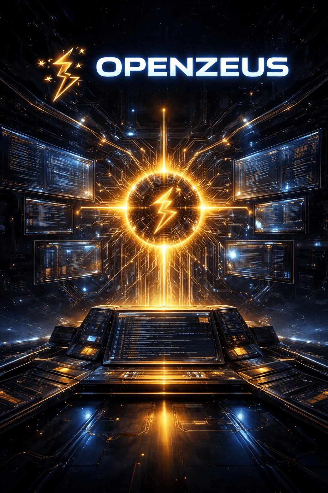

# OpenZeus

[](https://github.com/Aveer/OpenZeus/actions/workflows/ci.yml)
[](https://www.npmjs.com/package/openzeus)
[](LICENSE)

## Your OpenCode setup, explained

OpenZeus is an **OpenCode companion agent** for understanding and maintaining
your actual OpenCode environment.

Ask it why an agent is not loading, where a skill comes from, which
configuration wins, whether an old definition should be migrated, or how to
design a new OpenCode skill or agent.

```text
@OpenZeus why isn't my reviewer agent loading?
@OpenZeus where did this skill come from?
@OpenZeus audit my OpenCode setup and explain the problems.
@OpenZeus migrate this old agent to the current OpenCode format.
@OpenZeus design a portable skill for this workflow.
```

<p align="center">
  
</p>

OpenZeus is **not** an alternative to OpenCode. It uses OpenCode's native
configuration, agents, skills, commands and plugins wherever possible. Its
value is the layer on top: inspection, diagnosis, migration guidance and
higher-level asset design.

## What it is for

- **Understand the effective setup** — global vs project configuration,
  discovered assets, precedence and eventually provenance/shadowing.
- **Diagnose OpenCode problems** — invalid definitions, missing assets,
  configuration drift and compatibility issues.
- **Evolve old setups safely** — inspect first, plan changes, validate, back up
  and roll back when needed.
- **Design OpenCode assets** — especially reusable skills and more complex
  agent/command setups where a simple scaffold is not enough.
- **Prefer native OpenCode behavior** — OpenZeus should not duplicate a core
  feature just because it can.

## Installation

OpenZeus currently ships as an npm package that installs the OpenZeus agent
and its focused five-skill core into an OpenCode config directory.

Linux and macOS are supported directly. On Windows, use WSL.

```bash
npm install -g openzeus
openzeus install
```

The current installer resolves the target at runtime. You can override it with
`OPENCODE_CONFIG_DIR`; repository files do not contain user-specific absolute
paths.

> OpenZeus 2 now includes an unreleased native OpenCode V2 plugin prototype.
> It registers the five focused skills and a live `openzeus_runtime` tool.
> OpenCode V2 currently cannot add a new agent from a plugin because
> `AgentEditor` has no `add()`; the small agent-file bootstrap therefore
> remains transitional until upstream exposes that API.

## Use OpenZeus

The agent is the primary interface. The CLI is support machinery.

### Diagnose

```text
@OpenZeus audit my OpenCode setup.
@OpenZeus why isn't this skill available?
@OpenZeus explain which config applies here.
```

Current deterministic helpers:

```bash
openzeus doctor --fix-plan
openzeus validate --ci
openzeus diff --summary
```

These commands are being consolidated behind a simpler inspection/audit
surface as the refocus progresses.

### Create or improve a skill

```text
@OpenZeus create a reusable skill for our release workflow.
@OpenZeus review this SKILL.md for discovery and portability problems.
```

OpenZeus keeps dedicated skill-authoring guidance because OpenCode can load
skills natively but does not currently provide an equivalent dedicated skill
creator workflow.

### Work with agents

For a basic agent scaffold, prefer OpenCode's native creator:

```bash
opencode agent create
```

Use OpenZeus when the problem is architectural rather than mechanical:

```text
@OpenZeus design a reviewer agent with safe permissions and two specialist subagents.
@OpenZeus migrate this legacy agent definition without changing its behavior.
```

## Focused skills

OpenZeus now ships only skills that directly help operate or author OpenCode.

| Skill | Role |
|---|---|
| `zeus-diagnostics` | Runtime/config discovery, precedence and troubleshooting |
| `zeus-migration` | Safe OpenCode migration planning |
| `zeus-agents` | Advanced agent design and maintenance |
| `zeus-commands` | Command design and maintenance |
| `zeus-skills` | Skill authoring, discovery and portability |

Generic domain packs, pseudo-introspection skills and copied documentation for
external plugins are intentionally outside the OpenZeus core.

## Current CLI

OpenZeus 1.x still exposes helper commands while the plugin/runtime
architecture is being built:

```text
audit         Summarize actionable findings; --ci fails on warnings
inspect       Inventory filesystem-visible OpenCode sources, precedence and compatibility warnings\ninstall       Install the current agent/skill bundle
doctor        Check the installed OpenZeus bundle and propose fixes
validate      Validate OpenZeus/OpenCode asset structure
diff          Compare the packaged OpenZeus bundle with an installed copy
create        Create an agent, skill or command template
upgrade       Backup and refresh the installed OpenZeus bundle
rollback      Restore the latest OpenZeus backup
```

OpenZeus no longer ships generic project-management/Git slash commands.
Command authoring remains available through `@OpenZeus` and `openzeus create command`.

The old generic `setup`, `init-project`, recipe, context-init and
prompt-capture helpers have been removed from the refocus branch. OpenCode's
native `/init` owns project initialization; OpenZeus stays focused on
inspection, diagnosis, migration and OpenCode-specific authoring.

## Development

```bash
npm test
openzeus validate --ci
npm pack --dry-run
```

Architecture and campaign state:

- [OpenZeus 2 refocus plan](plans/openzeus-2-refocus.md)
- [OpenZeus 2 continuity](docs/continuity/openzeus-2.md)

## Version

Current stable package: **1.2.0**.

The OpenZeus 2 refocus is being developed separately from the stable release.

## Links

- Repository: https://github.com/Aveer/OpenZeus
- Issues: https://github.com/Aveer/OpenZeus/issues
- OpenCode Docs: https://opencode.ai/docs/
- NPM Package: https://npmjs.com/package/openzeus


## OpenCode V2 plugin prototype

The refocus branch exposes the package itself as a V2 plugin:

```jsonc
{
  "$schema": "https://opencode.ai/config.json",
  "plugins": ["openzeus"]
}
```

The plugin currently provides:

- the five focused `zeus-*` skills directly through the OpenCode skill registry;
- `openzeus_runtime`, a live-runtime tool that reports the current OpenCode
  version, location and safe summaries of active agents, skills, commands and
  plugins.

It deliberately omits raw agent prompts, skill contents, command templates and
plugin options from runtime output.

The plugin does **not** yet register the `@OpenZeus` agent itself. Current
OpenCode V2 can inspect/update/remove agents from a plugin but cannot add one,
so the agent-file bootstrap remains until that upstream limitation changes.
